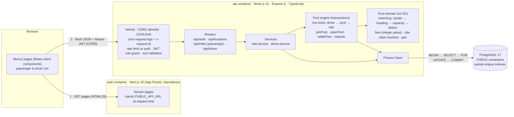
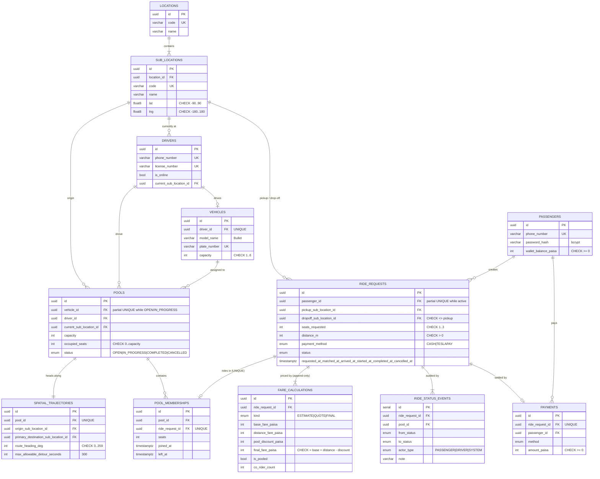
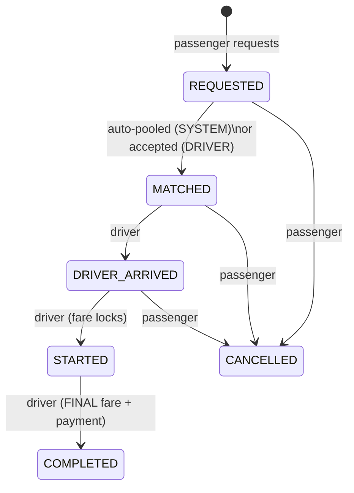

# 🛺 Dhaka Tesla Pool

**Share a seat. Split the fare. Survive Dhaka traffic.**

> 🎬 **Demo video (≤ 6 min):** _TODO — add Loom link_
> 🌐 **Live deployment:** _TODO — add URL (see [docs/deployment.md](docs/deployment.md))_
> 🏷️ **Release shown:** `release/v1.0.0`

8:41 AM, Banani Road 11. Jashim leans against **Bullet**, his three-seat battery rickshaw ("Tesla").
**Nusrat** books Banani → Mohakhali. Two minutes later **Rafiq** books Banani → Gulshan 1. In about a
second the app decides they can share, re-prices both fares, and tells Jashim to drop Nusrat first.
Thirty seconds later **Shirin** asks for the last seat, and concurrency gets properly interesting.

---

## Contents

1. [Problem & summary](#1-problem--summary)
2. [Features](#2-features)
3. [Screenshots](#3-screenshots)
4. [Architecture](#4-architecture)
5. [Database (ERD)](#5-database-erd)
6. [Ride & pool lifecycle](#6-ride--pool-lifecycle)
7. [Matching rule](#7-matching-rule)
8. [Fare model & money](#8-fare-model--money)
9. [Concurrency & consistency](#9-concurrency--consistency)
10. [Tech stack & why](#10-tech-stack--why)
11. [Project structure](#11-project-structure)
12. [Running it](#12-running-it)
13. [Demo credentials](#13-demo-credentials)
14. [API overview](#14-api-overview)
15. [Testing](#15-testing)
16. [Decisions, trade-offs, limitations, next steps](#16-decisions-trade-offs-limitations-next-steps)
17. [Deployment](#17-deployment)
18. [If Oi Tesla goes viral (bonus)](#18-if-oi-tesla-goes-viral-bonus)
19. [Git workflow](#19-git-workflow)
20. [AI usage](#20-ai-usage)

---

## 1. Problem & summary

Passengers want to get somewhere cheaply, and they will share a vehicle when someone is going the same
way. Drivers need to know who is riding, how many seats are taken, and in what order to stop. The hard
parts are not the screens. They are:

* **deciding fairly and quickly whether two trips can share** a Tesla,
* **never selling more seats than Bullet has**, even when two people tap *Request* at the same instant,
* **giving each passenger their own fare and status**, and never someone else's,
* **keeping enough history** to explain afterwards exactly what happened and why a fare was what it was.

This MVP is a Next.js web app, an Express + TypeScript REST API and PostgreSQL, all started with
`docker compose up`. The detailed rules were written down before the code, in
[docs/design.md](docs/design.md).

## 2. Features

**Passenger (Nusrat, Rafiq, Shirin)**
- Sign up / sign in (Bangladeshi mobile number + password), plus one-tap sign-in as any story cast member.
- Pick pickup and drop-off from 30 Dhaka points in 6 zones; choose 1–3 seats; pay with cash or TeslaPay.
- A **live fare estimate** shows the solo price and the pooled price before booking.
- On request the app **auto-pools** the ride into a compatible Tesla in about a second, or waits for a driver.
- Live status, polled every 3 s: *Looking for a Tesla → Matched → Driver arrived → On the way → Completed*.
- The seat meter shows the co-rider **count only**. Passengers never see other riders' names, destinations or fares.
- Cancel any time before pickup. A receipt appears after drop-off.
- History, plus a per-ride page showing **how the fare moved** and the full status timeline.

**Driver (Jashim + Bullet)**
- Sign in; go online / offline at a pickup point (going offline is blocked while riders are assigned).
- **Relevant requests** are the waiting rides in the driver's zone. Each shows *Accept*, or the exact reason
  it doesn't fit ("Only 1 of 3 seats left, 2 requested").
- **Current pool:** seat meter, planned **stop order** with names, per-rider *Mark arrived → Start → Dropped off*,
  and the cash still to collect.
- Trip history with every rider, status and payment.

**Pool / ride split**
- Several requests share one Tesla. `occupied_seats` never exceeds capacity; this is enforced in code *and* by a DB CHECK.
- Each passenger gets an individual fare for **their own distance**, with 25 % off the distance part when pooled.
- The lifecycle is explicit, and pool membership is visible to the driver.
- Every status change and every fare re-quote is stored (append-only), and payments are recorded on drop-off.

## 3. Screenshots

> _TODO: add after recording the demo (`docs/screenshots/`)._
> Suggested shots: landing with the cast picker · Nusrat's estimate (solo vs pooled) · Nusrat matched, seat
> meter 2/3 · Jashim's dashboard with stop order · Shirin's 2-seat request refused · ride detail showing the fare history.

## 4. Architecture



* **Browser → Next.js → Node.js API → Postgres.** Next.js serves the UI. The browser then calls the API
  directly with a bearer token, and the API is the only thing that talks to the database.
* **Business rules live in `api/src/domain`** as pure functions (matching, fares, transitions). They are
  easy to unit-test and reason about, with no framework in the way. `modules/pools/pool.engine.ts` wraps
  them in transactions and row locks.
* No Redis, queues or microservices: a single Postgres handles this load, and its transactions are exactly
  the consistency tool the problem needs.

**Changes from the first architecture draft** (kept honest, per brief §9): Next.js **16** instead of 14
(14 is end-of-life with unpatched critical advisories); **Prisma** chosen over Drizzle; sub-locations use a
**centre point** instead of a polygon; `fare_calculations` became **1-to-many, append-only**; I added
`ride_status_events` and `payments`; pool capacity is a per-pool snapshot checked by
`CHECK (occupied_seats <= capacity)` instead of a hard-coded 3; the capacity check runs **before** the
detour check (cheaper, and gives a clearer rejection reason).

## 5. Database (ERD)



| Table | Why it exists |
|---|---|
| `locations` / `sub_locations` | Zones (the matching cluster) and named points with a centre `lat/lng`. |
| `passengers` / `drivers` | Separate tables as in the original design: they share almost no columns (a wallet vs. a licence, online flag and location), and separate login endpoints mean a token can never be "upgraded" to the other role. |
| `vehicles` | Bullet, with fixed `capacity`. One vehicle per driver (`UNIQUE driver_id`). |
| `pools` | One trip of one Tesla. `capacity` is snapshotted so the CHECK can compare within one row; `driver_id` records who actually drove. |
| `spatial_trajectories` | The pool's direction (origin, first rider's destination, heading, detour budget), used by the matching rule. 1:1 with pools; re-anchored if the anchor rider cancels. |
| `ride_requests` | One passenger's trip. `distance_m` is fixed at request time so fares are reproducible. |
| `pool_memberships` | Which ride is in which pool. `UNIQUE ride_request_id`: a ride can never be in two pools. `left_at` records drop-off or cancel. |
| `fare_calculations` | Append-only fare history (ESTIMATE at request, QUOTE on every membership change, FINAL at drop-off). The CHECK makes every row add up. |
| `ride_status_events` | Audit trail: from → to, who did it, why. This is the "explain exactly what happened" table. |
| `payments` | What was collected and how; TeslaPay debits happen in the same transaction. |

Migrations: [`api/prisma/migrations`](api/prisma/migrations). `…_init` is generated from the Prisma
schema; `…_integrity_constraints` is hand-written SQL for the CHECKs and partial unique indexes Prisma
cannot express.

## 6. Ride & pool lifecycle



I kept the suggested lifecycle, with two deliberate refinements:

1. **Arrive / start / complete are per rider, not per pool.** Pooled riders are dropped at different places:
   Nusrat is COMPLETED at Mohakhali while Rafiq is still STARTED toward Gulshan 1.
2. **Pool status is derived, never set by hand** (`derivePoolStatus`): OPEN while nobody is on board,
   IN_PROGRESS once anyone is picked up (and then **closed to new riders**), COMPLETED or CANCELLED when
   nobody active is left. Occupied seats are recomputed from members after every change.

Any other transition, a skipped step or the wrong actor gets `409 INVALID_TRANSITION`.

## 7. Matching rule

A request **R** joins an OPEN pool **P** only if, checked cheapest-first:

| # | Rule | Stored in |
|---|---|---|
| 1 | P is OPEN (nobody on board) and its driver is online | `pools.status`, `drivers.is_online` |
| 2 | R's pickup is in the **same zone** as P's origin | `sub_locations.location_id` |
| 3 | R's heading is within **60°** of P's trajectory heading | `spatial_trajectories.route_heading_deg` |
| 4 | `occupied_seats + R.seats ≤ capacity`, re-checked **under the pool row lock** | `pools` |
| 5 | Some drop-off order keeps **every** rider within **300 s** of their solo trip time (all permutations tried, ≤ 3! = 6) | `max_allowable_detour_seconds` |

Distance is straight-line (equirectangular projection, whole metres) and time assumes **20 km/h**
(0.18 s per metre).

**Nusrat vs. Rafiq, by hand:** Banani Rd 11 (23.7940, 90.4043) → Mohakhali (23.7784, 90.4000) = **1 789 m**
at 194.2°. Banani Rd 11 → Gulshan 1 (23.7805, 90.4163) = **1 935 m** at 140.9°.
The headings differ by 53.3° ✅. Dropping Nusrat first, Rafiq rides 1 789 + 1 675 = 3 464 m instead of 1 935 m:
+1 529 m = **275 s** ✅. The other order would cost Nusrat 328 s ❌, so Jashim's stop order is
**Banani Rd 11 → Mohakhali → Gulshan 1**.

## 8. Fare model & money

```
distanceCharge = distance_m × 2 paisa × seats          (৳20 per km per seat)
baseFare       = 3 000 paisa                           (৳30)
poolDiscount   = floor(distanceCharge × 25 / 100)      only if the pool has ≥ 2 riders
passengerFare  = baseFare + distanceCharge − poolDiscount
```

| | Nusrat (1 789 m) | Rafiq (1 935 m) |
|---|---|---|
| base | 3 000 | 3 000 |
| distance | 3 578 | 3 870 |
| **solo** | **6 578 = ৳65.78** | **6 870 = ৳68.70** |
| pool discount | 894 | 967 |
| **pooled** | **5 684 = ৳56.84** | **5 903 = ৳59.03** |

* **You pay for your own distance only.** The detour the pool causes you is never billed, so pooling can
  only lower a fare.
* **When a fare changes:** ESTIMATE (solo) at request → a QUOTE whenever pool membership changes, for riders
  not yet picked up (Rafiq joining drops Nusrat's quote from 6 578 to 5 684; his cancelling would restore it)
  → **locked at pickup** → FINAL + payment at drop-off.
* **Money is integer paisa** everywhere: DB `INTEGER`, TypeScript `number`, converted to ৳ only when
  displayed. Integer arithmetic is exact (no `0.1 + 0.2` drift), rounding happens once and explicitly
  (`floor` on the discount), and values stay far below JavaScript's 2⁵³ safe-integer limit. `NUMERIC` would
  also be exact, but it arrives in JS as strings or Decimal objects and adds conversion bugs for no gain at
  this scale.
* **Payment:** cash, or the simulated **TeslaPay** wallet. The wallet must cover the *solo* estimate at
  request time (the maximum possible fare), and is debited at drop-off with a conditional
  `UPDATE … WHERE balance >= amount`. The `CHECK (wallet_balance_paisa >= 0)` constraint backs it up.
  Shirin's ৳40 wallet is refused for a ৳68.70 trip.

## 9. Concurrency & consistency

**The problem:** Bullet has 1 seat left. Nusrat and Shirin tap *Request* at the same instant, and both
read "1 seat free".

**What happens now:**
1. Each request builds a lock-free snapshot and ranks candidate pools.
2. Joining runs in one transaction that starts with `SELECT … FROM pools WHERE id = $1 FOR UPDATE`.
   The second transaction **blocks** on that row until the first commits.
3. After the lock is granted, the full matching rule is re-run on **fresh** data. The loser sees
   0 seats free and stays REQUESTED ("No seats left — all 3 are taken"), and drivers still see the request.
4. Even if application code were wrong, `CHECK (occupied_seats BETWEEN 0 AND capacity)` would reject the write.

Other guards: a fixed **lock order** (driver → pool → ride) prevents deadlocks. A partial unique index allows
**one active pool per vehicle** (a double-tapped *Accept* can't open two). Another allows **one active ride
per passenger** (a double-tapped *Request* can't create two). `UNIQUE(ride_request_id)` on memberships means
**a ride is in at most one pool**. Cancellation re-reads membership under lock and retries if a match raced
it. Fare-quote timestamps are taken *after* the lock, so "latest fare" follows lock order.

This is tested for real (`tests/integration/pooling.test.ts`: concurrent requests and concurrent accepts),
and I also exercised it against a live database: 5 back-to-back races, exactly one winner each time, both
Nusrat and Shirin won at least once, and no pool ever exceeded 3.

**At larger scale:** a hot pool row serialises only its own zone's requests, which is fine for a city MVP.
With many concurrent requests per zone, I would move matching to a **single writer per zone** (a
partitioned queue or actor per geo-cell), so requests are batched and assigned without lock contention.
I'd keep the DB constraints as the safety net and add idempotency keys; see §18.

## 10. Tech stack & why

| Choice | Picked | Realistic alternatives | Why it fits this MVP | Switch when… |
|---|---|---|---|---|
| Frontend | **Next.js 16** (App Router), React 19 | Vite + React Router, Remix | Recommended by the brief; file routing, and a standalone server image. The root layout reads `PUBLIC_API_URL` per request, so one image serves every environment. | Stays. Consider SSR data fetching / a BFF when we move tokens to httpOnly cookies. |
| Backend | **Express 5** + TypeScript | NestJS, Fastify | Small and explicit; Express 5 forwards async errors natively. The interesting logic is plain TS in `domain/`, so a framework adds little. | NestJS if the team or modules grow (DI, conventions); Fastify if JSON throughput becomes the bottleneck. |
| API style | **REST** | GraphQL, tRPC | Few resources, clear verbs (`/rides/:id/cancel`, `/driver/rides/:id/start`), cacheable GETs, trivial to test with curl. | GraphQL if many clients need different shapes of the same data. |
| Database | **PostgreSQL** | MySQL, SQLite | Pooling is a consistency problem: row locks, CHECKs, partial unique indexes, real transactions. SQLite's database-wide write lock and weaker constraints don't fit concurrent seat claims. | PostGIS when geo queries go beyond a handful of zones; read replicas for history. |
| ORM | **Prisma 6** | Drizzle, Knex, raw `pg` | Typed queries and a readable schema; interactive transactions; `$queryRaw` for `FOR UPDATE`; SQL migrations that can be hand-edited. | Drizzle if we need more SQL-level control or edge runtimes; raw SQL for hot paths. |
| Validation | **zod** | joi, class-validator | One schema gives both TS types and runtime checks; the same library validates env config. | Stays. |
| Auth | **JWT (HS256) bearer + bcrypt** | Sessions + Redis, Auth.js, Clerk | Stateless and simple across two containers; roles in the token; no extra infra. | httpOnly refresh cookies + short-lived access tokens before real users; OAuth/OTP for phone login. |
| Logging | **pino** + pino-http | winston, morgan | Structured JSON, request ids, redaction of passwords and tokens. | Ship to Loki/Datadog with OpenTelemetry traces. |
| Styling | **Plain CSS** (one file, CSS variables, dark mode) | Tailwind, CSS modules, MUI | ~15 components; zero build config; the brief asks for simple and clean. | Tailwind or a design system once more people touch the UI. |
| Tests | **Vitest** + Supertest | Jest | Fast, TS-native. Integration tests hit **real Postgres**, because the risky parts are locks and constraints, which mocks would hide. | Stays; add Playwright for UI flows. |
| Containers | **Docker Compose** | k8s, Nomad | One command, health-checked startup order. | Managed containers (ECS/Cloud Run/Fly) in production. |

## 11. Project structure

```
.
├── api/                         Express + Prisma REST API
│   ├── prisma/
│   │   ├── schema.prisma        tables, enums, indexes
│   │   └── migrations/          init + integrity_constraints (CHECKs, partial unique indexes)
│   ├── src/
│   │   ├── domain/              pure rules: matching.ts, fare.ts, geo.ts, rideStateMachine.ts, rules.ts
│   │   ├── modules/
│   │   │   ├── auth/            signup/login, profile
│   │   │   ├── rides/           passenger endpoints, views (what a passenger may see)
│   │   │   ├── driver/          availability, requests, accept, arrive/start/complete
│   │   │   ├── pools/           pool.engine.ts: transactions, row locks, derived pool state
│   │   │   ├── locations/       zones & sub-locations
│   │   │   └── health/
│   │   ├── middleware/          auth guard, error handler
│   │   ├── lib/                 prisma, jwt, password, logger, errors
│   │   ├── db/                  seed data (the story cast), seeders
│   │   ├── config/env.ts        zod-validated environment
│   │   ├── app.ts / server.ts
│   ├── tests/unit/              fare, geo, matching, state machine, jwt
│   ├── tests/integration/       auth + pooling against Postgres
│   ├── Dockerfile · docker-entrypoint.sh
├── web/                         Next.js app
│   └── src/
│       ├── app/                 / · login · signup · passenger(/history, /rides/[id]) · driver(/history)
│       ├── components/          RideBits, States, LocationSelect, passenger/*, driver/*
│       └── lib/                 session (auth + API client), hooks (polling), format, types
├── docker-compose.yml · .env.example · docker/postgres/init/
└── docs/                        design.md · deployment.md · scaling.md
```

## 12. Running it

### Prerequisites
* **Docker path:** Docker Desktop / Engine with Compose v2.
* **Local path:** Node.js ≥ 20.9 (developed on 22), PostgreSQL ≥ 14.

### Environment variables

Root [`.env.example`](.env.example) (used by compose; every value has a safe local default):

| Variable | Used by | Meaning |
|---|---|---|
| `POSTGRES_USER` / `POSTGRES_PASSWORD` / `POSTGRES_DB` | db, api | Database credentials |
| `JWT_SECRET` | api | HS256 signing key, ≥ 16 chars. **Set a real one anywhere public.** |
| `JWT_EXPIRES_IN` | api | Token lifetime (default `12h`) |
| `CORS_ORIGIN` | api | Comma-separated allowed web origins |
| `SEED_ON_START` | api | Seed zones + the cast on container start (idempotent) |
| `LOG_LEVEL` | api | pino level |
| `PUBLIC_API_URL` | web | API URL **as the browser sees it**; read per request |
| `WEB_PORT` / `API_PORT` / `DB_PORT` | compose | Host ports (DB defaults to **5433** to avoid clashing with a local Postgres) |

For running without Docker: [`api/.env.example`](api/.env.example) (adds `DATABASE_URL`, `TEST_DATABASE_URL`, `PORT`)
and [`web/.env.example`](web/.env.example).

### Option A: Docker (one command)

```bash
cp .env.example .env          # optional; edit secrets
docker compose up --build
```

* Web → http://localhost:3000 · API → http://localhost:4000/health
* Startup order is health-checked: **db → api → web**. The API container runs `prisma migrate deploy`
  and then the idempotent seed before it starts serving.
* Reset everything: `docker compose down -v`.

### Option B: Local

```bash
# API
cd api
cp .env.example .env               # point DATABASE_URL at your Postgres
npm ci
npx prisma migrate deploy          # migrations
npm run db:seed                    # zones + Nusrat, Rafiq, Shirin, Jashim/Bullet
npm run dev                        # http://localhost:4000

# Web (second terminal)
cd web
cp .env.example .env.local
npm ci
npm run dev                        # http://localhost:3000
```

Useful scripts: `npm run db:reset` (drop, re-migrate, re-seed; dev only), `npm run build && npm start`.

## 13. Demo credentials

Every account's password is **`oitesla123`**. The landing and login pages also have one-tap buttons for each cast member.

| Who | Role | Phone | Notes |
|---|---|---|---|
| Nusrat | passenger | `01711000001` | TeslaPay ৳500 |
| Rafiq | passenger | `01711000002` | TeslaPay ৳500 |
| Shirin | passenger | `01711000003` | TeslaPay **৳40**: shows the low-balance edge case |
| Jashim | driver | `01811000001` | Drives **Bullet** (3 seats), starts online at Banani Road 11 |

**Demo script:** open two windows (Jashim in one, a passenger in a private window). Nusrat requests
Banani Rd 11 → Mohakhali → Jashim accepts → Rafiq requests Banani Rd 11 → Gulshan 1 (auto-pooled, and both
fares drop) → Shirin asks for 2 seats (refused: 1 seat left) → Shirin asks for 1 (Bullet full) → Jashim
arrives / starts / drops off in the planned order.

## 14. API overview

All JSON. Errors look like `{ "error": { "code", "message", "details?" } }` with stable `code`s
(`VALIDATION_ERROR`, `INVALID_TRANSITION`, `NO_SEATS`, `ACTIVE_RIDE_EXISTS`, `INSUFFICIENT_BALANCE`, …).
Authenticated routes need `Authorization: Bearer <token>`.

| Method & path | Who | What |
|---|---|---|
| `GET /health` | public | Liveness + DB check |
| `POST /api/auth/passengers/signup` | public | `{name, phoneNumber, password}` → `{token, user}` |
| `POST /api/auth/passengers/login` | public | `{phoneNumber, password}` → `{token, user}` |
| `POST /api/auth/drivers/login` | public | same, for drivers |
| `GET /api/auth/me` | any | Profile (wallet for passengers; vehicle and location for drivers) |
| `GET /api/locations` | public | Zones with sub-locations |
| `POST /api/rides/estimate` | passenger | `{pickupId, dropoffId, seats}` → distance, solo & pooled fare |
| `POST /api/rides` | passenger | `{pickupId, dropoffId, seats, paymentMethod}` → `{ride, autoMatch}` |
| `GET /api/rides` | passenger | Own history (`?limit=`) |
| `GET /api/rides/current` | passenger | Own active ride or `null` |
| `GET /api/rides/:id` | passenger | Own ride + fare history + timeline (**404 if not yours**) |
| `POST /api/rides/:id/cancel` | passenger | `{reason?}`; only before pickup |
| `PATCH /api/driver/availability` | driver | `{online, subLocationId?}` |
| `GET /api/driver/requests` | driver | Waiting rides in the driver's zone, with `canAccept` + `reason` |
| `POST /api/driver/requests/:rideId/accept` | driver | Open a pool, or add to the driver's OPEN pool |
| `GET /api/driver/pool/current` | driver | Riders, seats, stop order, fares |
| `POST /api/driver/rides/:rideId/arrive` · `/start` · `/complete` | driver | Per-rider progress (only rides in own pool) |
| `GET /api/driver/pools` | driver | Pool history |

## 15. Testing

```bash
cd api
npm run test:unit          # pure domain tests, no database needed
npm run test:integration   # needs TEST_DATABASE_URL → a database whose name ends in _test
npm test                   # both
# or, fully in Docker:
docker compose --profile test run --rm api-test
```

**70 tests** (unit + integration against Postgres). They cover exactly what the brief asks:

| Risk | Where |
|---|---|
| Bullet's capacity can never be exceeded (app rule, 2-seat request refused, DB CHECK rejects a direct `UPDATE`, one active pool per vehicle) | `integration/pooling.test.ts`, `unit/matching.test.ts` |
| Invalid state transitions rejected (skip steps, go backwards, wrong actor; the full transition table) | `unit/rideStateMachine.test.ts`, `integration/pooling.test.ts` |
| Nusrat's and Rafiq's pooled fares (6578/5684 and 6870/5903, re-quote on join, FINAL on drop-off, TeslaPay debit) | `unit/fare.test.ts`, `integration/pooling.test.ts` |
| Users can't modify another user's ride (404, no co-rider leakage, role separation) | `integration/pooling.test.ts`, `integration/auth.test.ts` |
| Cancellation rules (allowed before pickup only, frees the seat, removes the pool discount, empties the pool) | `integration/pooling.test.ts` |
| Two concurrent requests can't corrupt capacity (Nusrat vs Shirin for the last seat; double accept) | `integration/pooling.test.ts` |

Integration tests refuse to run unless the database name ends in `_test`, because they truncate tables.

## 16. Decisions, trade-offs, limitations, next steps

**Key decisions**
* **Auto-pool on request, manual accept for the first rider.** The first rider needs a driver's consent to
  start a trip. After that, a driver with an OPEN pool has effectively opted in to compatible riders, which
  delivers the "decide in about a second" from the story.
* **The rules are pure functions**, and the DB layer only locks, loads snapshots and writes. That is why the
  matching and fare logic can be tested exhaustively without a database.
* **Pessimistic row locks** rather than optimistic versioning: contention is per pool (tiny), and blocking
  gives the loser a clear, correct answer instead of a retry loop.
* **404 instead of 403** for other people's rides, so ride ids can't be probed.

**Trade-offs**
* **Polling (3 s)** instead of WebSockets/SSE: simpler, stateless, and works behind any proxy; it costs some
  latency and extra requests.
* **JWT in `localStorage`**: simple across two origins, but readable by XSS. A production version would use
  an httpOnly refresh cookie through a same-origin BFF.
* **Straight-line distance**: hand-checkable and needs no API, but it under-estimates real road distance.

**Known limitations**
* No pickups en route: a pool closes once anyone is on board.
* REQUESTED rides don't expire, and there are no cancellation fees, driver no-show handling or ratings.
* One Tesla per driver; no admin UI; no password reset.
* The Prisma CLI's `deepmerge-ts` advisory is patched with an npm override to 8.x.
* Docker files are written to the brief but were not run on the development machine (no Docker there);
  the compiled artefacts they run (`dist/server.js`, `dist/db/seed.js`, `next build` standalone) were verified.

**Next improvements**
Ride-request expiry job · driver no-show / cancel with fee rules · SSE for live status · httpOnly auth
cookies + refresh tokens · PostGIS + a road-distance matrix · Playwright end-to-end tests · ratings ·
admin audit view over `ride_status_events`.

## 17. Deployment

Free tier only. The plan (Neon Postgres + Render for the API + Vercel for the web), including the exact
env vars, is in **[docs/deployment.md](docs/deployment.md)**.
_Deployment URL: TODO._

## 18. If Oi Tesla goes viral (bonus)

Scaling to 1 M passengers and 100 k drivers covers load balancing, per-zone matching, geospatial indexes,
real-time delivery, idempotency, contention and observability. It's reasoned through in
**[docs/scaling.md](docs/scaling.md)**.

## 19. Git workflow

* Long-lived branches: `master`, `pre-release`, `release/v1.0.0`.
* One `feature/*` branch per logical change: `architecture-docs`, `api-scaffold`, `database-schema`,
  `passenger-auth`, `fare-engine`, `tesla-pooling`, `driver-flow`, `pooling-tests`, `web-passenger`,
  `web-driver`, `docker`. Each is merged into `master` with `--no-ff` (or through a GitHub PR), so the
  history shows every feature.
* `pre-release` was cut after the MVP was integrated, for docs, integration fixes and deployment checks.
  `release/v1.0.0` was cut from it.
* Commits follow `<type>(<scope>): <description>` (`feat`, `fix`, `test`, `docs`, `build`, `chore`, `refactor`).

## 20. AI usage

> ✍️ _Draft: rewrite in your own words before submitting. The brief asks for your ownership._

* **Tools:** Claude Code (Claude Opus) as a pair programmer in the editor and terminal, plus official docs
  (Prisma, Next.js, Express 5).
* **Used for:** turning the architecture draft into a design doc; scaffolding; the matching planner and fare
  model; integration tests; Docker files; README drafting. Every rule was checked by hand against the story
  numbers and exercised against a real Postgres (including a live last-seat race).
* **Accepted suggestion:** serialising seat claims with `SELECT … FOR UPDATE` on the pool row, re-running
  the full matching rule after the lock is granted, and keeping `CHECK (occupied_seats BETWEEN 0 AND capacity)`
  as a DB-level backstop. It is simple, correct under concurrency, and easy to explain.
* **Rejected / changed suggestions:**
  * `npm install` pulled in **TypeScript 7** and **Next.js 14**. I pinned TypeScript 5.9 (proven with Prisma
    and Next) and moved to **Next.js 16**, because 14 is end-of-life with unpatched critical advisories.
  * The first draft stored **one fare row per ride** (1:1 in the original ERD). I changed it to an
    **append-only history** (ESTIMATE → QUOTE… → FINAL) so the system can explain *why* Nusrat paid ৳56.84
    and not ৳65.78.
  * The first matching order checked detour before capacity. I swapped them: capacity is cheaper, and
    "only 1 seat left" is a better answer for Shirin than a detour error.
