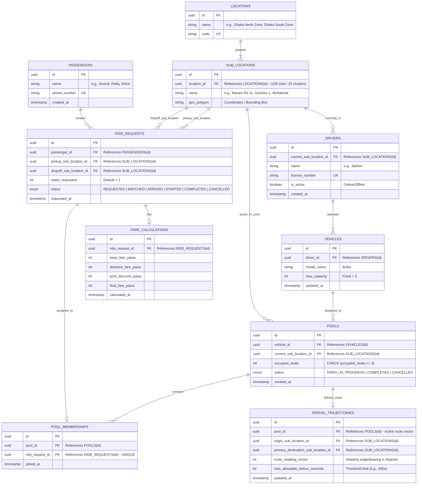

```mermaid

graph TD
    %% CLIENT LAYER
    subgraph Client_Layer["1. Client Layer (Next.js 14 / React)"]
        PassengerApp["Passenger Client<br/>(Nusrat, Rafiq, Shirin)"]
        DriverApp["Driver Client<br/>(Jashim)"]
    end

    %% API GATEWAY & ROUTER
    Client_Layer -- "HTTPS / REST API" --> API_Gateway

    subgraph Backend_Layer["2. Application Service Layer (Node.js Engine)"]
        API_Gateway["API Router & Express Middleware"]

        %% AUTH & CONTROLLERS
        subgraph Controllers["API Controllers"]
            PassengerCtrl["Passenger Controller"]
            DriverCtrl["Driver Controller"]
            RideCtrl["Ride Request Controller"]
        end

        API_Gateway --> PassengerCtrl
        API_Gateway --> DriverCtrl
        API_Gateway --> RideCtrl

        %% CORE MATCHING & POOLING ENGINE
        subgraph Core_Engine["Dynamic Spatial Match & Pooling Engine"]
            
            subgraph Geo_Lookup["Sub-Location Cluster Engine"]
                LocFilter["Location Filter<br/>(100 Locations / 25 Sub-Locations)"]
            end

            subgraph Trajectory_Engine["Spatial Trajectory Evaluator"]
                VectorCalc["Heading Vector Angle Evaluator"]
                DetourCheck["Detour Buffer Checker<br/>(Max 300s Limit)"]
            end

            subgraph Capacity_Engine["Capacity Guard"]
                SeatLock["Atomic Seat Lock Check<br/>(Occupied + Requested <= 3)"]
            end

            subgraph Fare_Engine["Fare Ledger Engine"]
                CoopFareCalc["Paisa Fare Splitter<br/>(Base + Distance - Pool Discount)"]
            end

        end

        RideCtrl --> LocFilter
        LocFilter --> VectorCalc
        VectorCalc --> DetourCheck
        DetourCheck --> SeatLock
        SeatLock --> CoopFareCalc
    end

    %% DATA LAYER
    subgraph Data_Layer["3. Database Layer (PostgreSQL)"]
        ORM["ORM Query Builder (Prisma / Drizzle)"]

        subgraph Relational_DB["PostgreSQL Tables"]
            passengers_tb[("passengers")]
            drivers_tb[("drivers")]
            vehicles_tb[("vehicles")]
            locations_tb[("locations & sub_locations")]
            ride_requests_tb[("ride_requests")]
            spatial_trajectories_tb[("spatial_trajectories")]
            pools_tb[("pools & pool_memberships")]
            fare_calculations_tb[("fare_calculations")]
        end

        CoopFareCalc -- "BEGIN TRANSACTION (Atomic Write)" --> ORM
        ORM --> Relational_DB
    end

    %% STYLING
    classDef client fill:#0f172a,stroke:#38bdf8,stroke-width:2px,color:#f8fafc;
    classDef controller fill:#1e293b,stroke:#a855f7,stroke-width:2px,color:#f8fafc;
    classDef engine fill:#1e1b4b,stroke:#ec4899,stroke-width:2px,color:#f8fafc;
    classDef database fill:#022c22,stroke:#22c55e,stroke-width:2px,color:#f8fafc;

    class PassengerApp,DriverApp client;
    class API_Gateway,PassengerCtrl,DriverCtrl,RideCtrl controller;
    class LocFilter,VectorCalc,DetourCheck,SeatLock,CoopFareCalc engine;
    class ORM,passengers_tb,drivers_tb,vehicles_tb,locations_tb,ride_requests_tb,spatial_trajectories_tb,pools_tb,fare_calculations_tb database;


```

```mermaid


erDiagram
    LOCATIONS ||--|{ SUB_LOCATIONS : "contains"
    SUB_LOCATIONS ||--o{ DRIVERS : "currently_in"
    SUB_LOCATIONS ||--o{ RIDE_REQUESTS : "pickup_sub_location"
    SUB_LOCATIONS ||--o{ RIDE_REQUESTS : "dropoff_sub_location"
    
    DRIVERS ||--o{ VEHICLES : "operates"
    VEHICLES ||--o{ POOLS : "assigned_to"
    
    SUB_LOCATIONS ||--o{ POOLS : "active_in_zone"
    POOLS ||--o{ POOL_MEMBERSHIPS : "contains"
    POOLS ||--o| SPATIAL_TRAJECTORIES : "follows_route"
    
    PASSENGERS ||--o{ RIDE_REQUESTS : "creates"
    RIDE_REQUESTS ||--o| POOL_MEMBERSHIPS : "assigned_to"
    RIDE_REQUESTS ||--o| FARE_CALCULATIONS : "has"

    LOCATIONS {
        uuid id PK
        string name "e.g., Dhaka North Zone, Dhaka South Zone"
        string code UK
    }

    SUB_LOCATIONS {
        uuid id PK
        uuid location_id FK "References LOCATIONS(id) - (100 total / 25 clusters)"
        string name "e.g., Banani Rd 11, Gulshan 1, Mohakhali"
        string geo_polygon "Coordinates / Bounding Box"
    }

    PASSENGERS {
        uuid id PK
        string name "e.g., Nusrat, Rafiq, Shirin"
        string phone_number UK
        timestamp created_at
    }

    DRIVERS {
        uuid id PK
        uuid current_sub_location_id FK "References SUB_LOCATIONS(id)"
        string name "e.g., Jashim"
        string license_number UK
        boolean is_active "Online/Offline"
        timestamp created_at
    }

    VEHICLES {
        uuid id PK
        uuid driver_id FK "References DRIVERS(id)"
        string model_name "Bullet"
        int max_capacity "Fixed = 3"
        timestamp updated_at
    }

    POOLS {
        uuid id PK
        uuid vehicle_id FK "References VEHICLES(id)"
        uuid current_sub_location_id FK "References SUB_LOCATIONS(id)"
        int occupied_seats "CHECK (occupied_seats <= 3)"
        enum status "OPEN | IN_PROGRESS | COMPLETED | CANCELLED"
        timestamp created_at
    }

    SPATIAL_TRAJECTORIES {
        uuid id PK
        uuid pool_id FK "References POOLS(id) - Active route vector"
        uuid origin_sub_location_id FK "References SUB_LOCATIONS(id)"
        uuid primary_destination_sub_location_id FK "References SUB_LOCATIONS(id)"
        int route_heading_vector "Heading angle/bearing in degrees"
        int max_allowable_detour_seconds "Threshold limit (e.g., 300s)"
        timestamp updated_at
    }

    RIDE_REQUESTS {
        uuid id PK
        uuid passenger_id FK "References PASSENGERS(id)"
        uuid pickup_sub_location_id FK "References SUB_LOCATIONS(id)"
        uuid dropoff_sub_location_id FK "References SUB_LOCATIONS(id)"
        int seats_requested "Default = 1"
        enum status "REQUESTED | MATCHED | ARRIVED | STARTED | COMPLETED | CANCELLED"
        timestamp requested_at
    }

    POOL_MEMBERSHIPS {
        uuid id PK
        uuid pool_id FK "References POOLS(id)"
        uuid ride_request_id FK "References RIDE_REQUESTS(id) - UNIQUE"
        timestamp joined_at
    }

    FARE_CALCULATIONS {
        uuid id PK
        uuid ride_request_id FK "References RIDE_REQUESTS(id)"
        int base_fare_paisa
        int distance_fare_paisa
        int pool_discount_paisa
        int final_fare_paisa
        timestamp calculated_at
    }

```