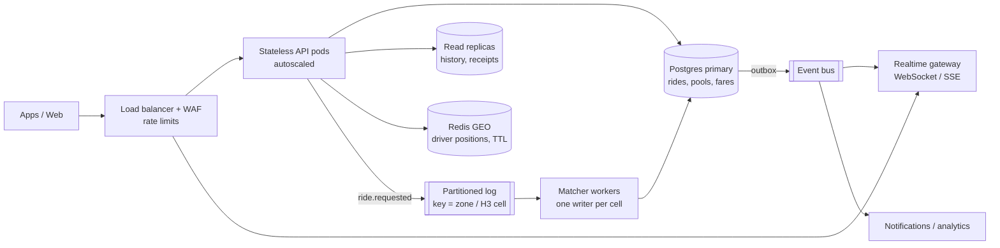

# If Oi Tesla goes viral: 1 M passengers, 100 k drivers

The MVP is deliberately one API process and one Postgres. This note explains what breaks first at scale
and what I would change, in order. The goal is to add each piece only when a metric says it's needed.

## Rough load

* 1 M passengers, around 10 % active on a peak day, with ~2 rides each → ~200 k rides/day. A peak hour
  carries ~15 % of that: **~30 k ride requests/hour ≈ 10 per second**, with bursts of maybe 50/s.
* 100 k drivers polling every 3 s would be **~33 k req/s** of *reads*. That, not ride writes, is the first
  real load problem, and it is why polling has to go.
* Location pings (if we add live GPS every 5 s) from 100 k drivers ≈ **20 k writes/s**. They must not go
  into the main Postgres.

## Target shape

## Topic by topic

**Load balancing & horizontal scaling.** The API is already stateless (JWT, no sessions), so it can run as
N pods behind an L7 balancer with autoscaling on CPU and p95 latency. The web app is static-ish and belongs
on a CDN. Postgres is the only stateful piece.

**Database: indexing, replicas, contention.** The hot queries already have indexes (`pools(status,
current_sub_location_id)`, `ride_requests(status, pickup_sub_location_id)`, partial uniques). Next steps:
send history and receipts to **read replicas**; **partition** `ride_status_events` and `fare_calculations`
by month (append-only, and they grow fastest); use PgBouncer in front of the primary. The contended rows
are *pool rows in busy zones*, and the matcher redesign below removes most of that contention.

**Ride matching.** Today each request locks candidate pools itself. At scale I would switch to **single
writer per geo-cell**: requests go onto a log partitioned by H3 cell (or zone), and one matcher worker per
partition assigns them in micro-batches (e.g. every 250 ms). No two workers ever touch the same pool, so
there are no lock waits, and batching allows better assignments (Hungarian or greedy over the batch instead
of first-come). The `CHECK` constraints and unique indexes stay as the safety net.

**Geospatial search.** Replace fixed zones with **H3 cells** (resolution ~8 ≈ 0.7 km²) plus neighbour
rings. Keep live driver positions in **Redis GEO** with a short TTL (a dead phone disappears on its own),
and use PostGIS only for durable geo data. Swap straight-line distance for a road-time matrix (OSRM,
self-hosted) cached per cell pair.

**Real-time.** Replace 3 s polling with **SSE or WebSockets** through a dedicated gateway. Status changes
are written to an **outbox table** in the same transaction as the ride update, relayed to the event bus,
and pushed to exactly the passenger and driver concerned. That cuts ~33 k req/s of polling to one push per
event.

**Queues / events.** The partitioned log (Kafka, Redpanda or Kinesis) exists for *matching order and
fan-out*, not decoration. With the outbox, events are published exactly when the DB commits, never before
and never lost.

**Idempotency & retries.** `POST /rides`, `/accept` and `/complete` take an `Idempotency-Key` header, stored
with the response for 24 h, so a retried request after a timeout never double-books or double-charges.
Clients retry only idempotent calls, with jittered exponential backoff. Serialisation and deadlock errors
(`40001`/`40P01`; today only Prisma's `P2034` write-conflict is mapped to `409 RETRY`) would be retried
server-side up to 3 times before surfacing.

**Rate limiting.** At the gateway: per IP for auth, per user for ride creation (e.g. 5/min), and per driver
for accepts. The MVP already rate-limits credential endpoints.

**Payments.** Wallet debits become a **double-entry ledger** (`ledger_entries` that must sum to zero)
instead of a mutable balance, with a unique `(ride_id, kind)` so a retry can't debit twice.

**Observability.** OpenTelemetry traces from gateway to DB. RED metrics per endpoint, plus business
metrics: match rate, time-to-match, seats utilisation, pool-lock wait p99, cancellation rate per status.
Keep structured logs with request ids (already present). SLO alerts on time-to-match and error budget.

**Failure strategy.** If the matcher is down, requests queue and passengers see "looking for a Tesla"; they
are never lost. If a DB replica lags, history reads fall back to the primary. If a region is lost: Postgres
with a synchronous standby, the API in two zones. A pool never ends up half-committed, because every pool
mutation is one transaction.

**Security.** Short-lived access tokens with httpOnly refresh cookies, phone OTP login, secrets in a
manager (not env files), a WAF, and PII minimisation (co-riders already see only a count). Every driver
action is authorised against pool ownership, as it is today.

**Deployment.** Containers on a managed orchestrator (ECS, Cloud Run or k8s once there is a platform team),
blue/green or canary releases, and **expand → migrate → contract** schema migrations so old and new pods
work against the same schema during a rollout.

## What I would *not* do yet

Microservices per entity, multi-region active-active writes, or a custom routing engine. None of these
address the actual bottlenecks above (polling fan-out, per-zone contention, location writes), and each adds
operational cost before it adds value.
